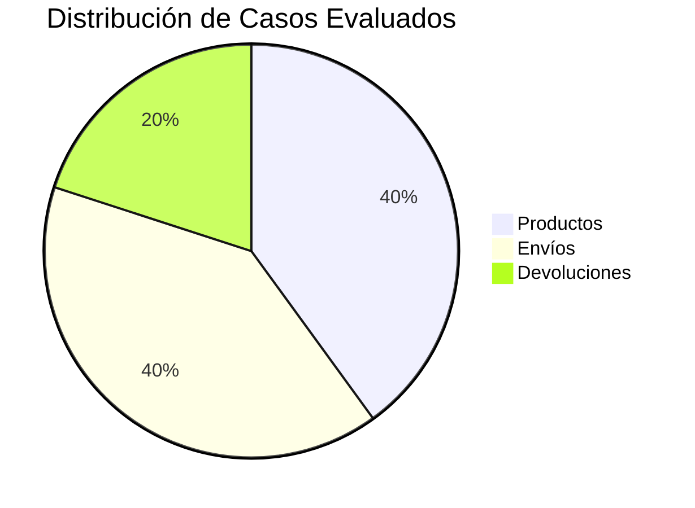
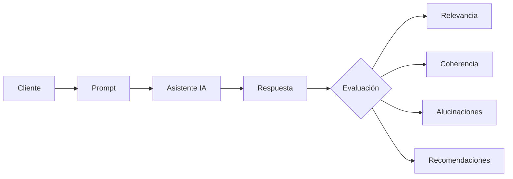
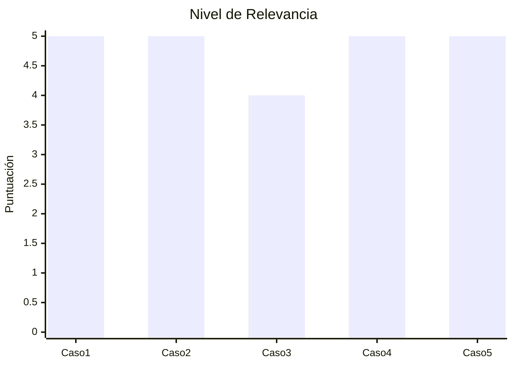
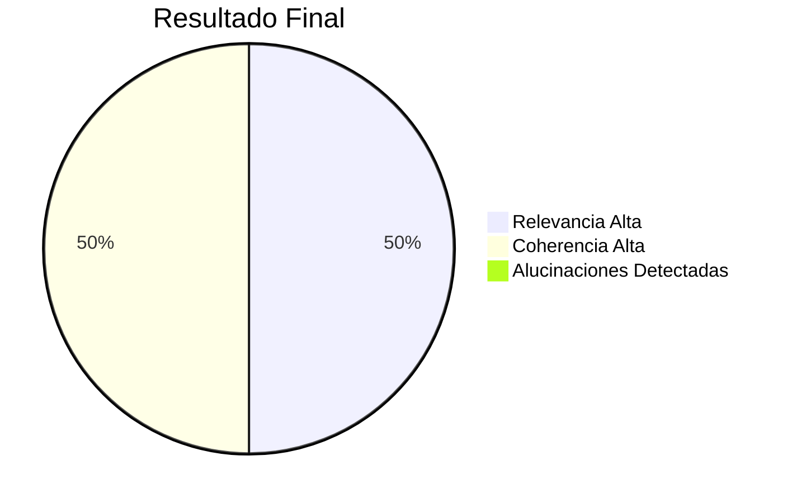

# 🤖 Testing de Sistemas de Inteligencia Artificial

## 📌 Objetivo

Evaluar la calidad de las respuestas generadas por un asistente de inteligencia artificial para una tienda en línea, verificando su relevancia, coherencia y posibles alucinaciones.

---

# 📊 Distribución de Casos de Prueba

---

# 🔄 Flujo de Evaluación

---

# 📋 Matriz de Casos de Prueba

| Caso | Categoría | Relevancia | Coherencia | Alucinaciones |
|------|-----------|------------|------------|----------------|
| 1 | Productos | ⭐⭐⭐⭐⭐ | ⭐⭐⭐⭐⭐ | No |
| 2 | Envíos | ⭐⭐⭐⭐⭐ | ⭐⭐⭐⭐⭐ | No |
| 3 | Productos | ⭐⭐⭐⭐⭐ | ⭐⭐⭐⭐⭐ | No |
| 4 | Garantías | ⭐⭐⭐⭐⭐ | ⭐⭐⭐⭐⭐ | No |
| 5 | Devoluciones | ⭐⭐⭐⭐☆ | ⭐⭐⭐⭐⭐ | No |

---

# 🧪 Caso de Prueba 1

## Prompt probado

> ¿Qué laptop recomiendas para programación?

### Input

Cliente busca una laptop para desarrollo con presupuesto de $1000.

### Respuesta obtenida

Se recomendaron equipos con procesador Intel Core i5 o AMD Ryzen 5, 16 GB de RAM y SSD de 512 GB.

### Evaluación

| Criterio | Resultado |
|----------|-----------|
| Relevancia | ⭐⭐⭐⭐⭐ |
| Coherencia | ⭐⭐⭐⭐⭐ |
| Alucinaciones | No |

### Recomendación

Agregar enlaces a productos disponibles.

---

# 🧪 Caso de Prueba 2

## Prompt probado

> ¿Cuánto tarda un envío?

### Input

Envío nacional.

### Respuesta obtenida

Entre 3 y 5 días hábiles.

### Evaluación

| Criterio | Resultado |
|----------|-----------|
| Relevancia | ⭐⭐⭐⭐⭐ |
| Coherencia | ⭐⭐⭐⭐⭐ |
| Alucinaciones | No |

### Recomendación

Incluir tiempos para envíos internacionales.

---

# 🧪 Caso de Prueba 3

## Prompt probado

> ¿Cuánto cuesta el envío a Quito?

### Input

Destino Quito.

### Respuesta obtenida

El costo depende del peso y la dirección.

### Evaluación

| Criterio | Resultado |
|----------|-----------|
| Relevancia | ⭐⭐⭐⭐☆ |
| Coherencia | ⭐⭐⭐⭐⭐ |
| Alucinaciones | No |

### Recomendación

Mostrar una tarifa estimada.

---

# 🧪 Caso de Prueba 4

## Prompt probado

> ¿Los celulares Samsung tienen garantía?

### Input

Producto Samsung.

### Respuesta obtenida

Sí, cuentan con garantía del fabricante.

### Evaluación

| Criterio | Resultado |
|----------|-----------|
| Relevancia | ⭐⭐⭐⭐⭐ |
| Coherencia | ⭐⭐⭐⭐⭐ |
| Alucinaciones | No |

### Recomendación

Especificar el tiempo de garantía.

---

# 🧪 Caso de Prueba 5

## Prompt probado

> ¿Cómo puedo devolver un producto?

### Input

Producto defectuoso.

### Respuesta obtenida

Puede solicitar la devolución dentro de los primeros 30 días presentando el comprobante de compra.

### Evaluación

| Criterio | Resultado |
|----------|-----------|
| Relevancia | ⭐⭐⭐⭐⭐ |
| Coherencia | ⭐⭐⭐⭐⭐ |
| Alucinaciones | No |

### Recomendación

Indicar si el envío de devolución tiene costo.

---

# 📈 Resumen de Evaluaciones

---

# 📊 Evaluación General

---

# 📌 Conclusión

Se evaluaron cinco escenarios representativos relacionados con consultas frecuentes de una tienda en línea.

Los resultados obtenidos muestran que el asistente de inteligencia artificial generó respuestas relevantes y coherentes para todos los casos analizados. No se identificaron alucinaciones durante las pruebas realizadas.

Como oportunidades de mejora, se recomienda:

- Incorporar costos estimados de envío según la ubicación.
- Mostrar tiempos de garantía específicos por producto.
- Ofrecer enlaces directos a productos recomendados.
- Proporcionar información más detallada sobre el proceso de devoluciones.

En conclusión, el asistente demuestra un buen desempeño para responder consultas comunes de clientes y constituye una herramienta útil para mejorar la atención al usuario.

---
